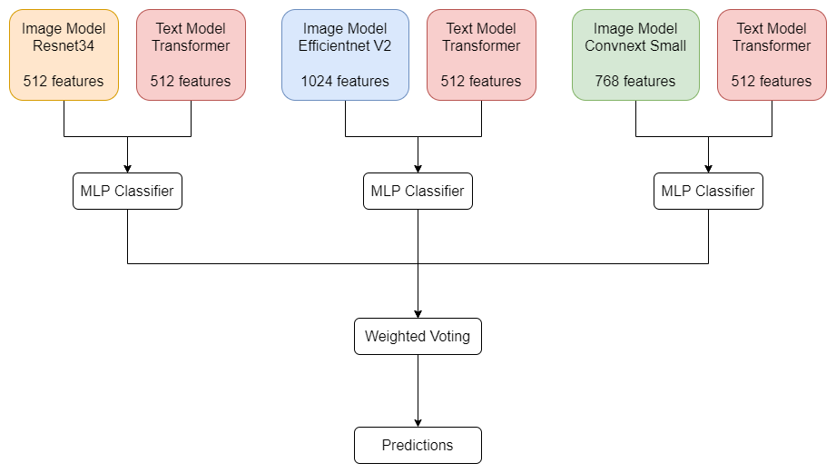

# Worflow

The goal of this project is to classify e-commerce products into 27 categories. 

Each e-commerce product falls into eactly one of the 27 categories: Topwear, Shoes, Bags, Bottomwear, Watches, Innerwear, Eyewear, Fragrance, Jewellery, Sandal, Flip Flops, Wallets, Belts, Socks, Loungewear and Nightwear, Dress, Lips, Saree, Makeup, Nails, Ties, Headwear, Accessories, Scarves, Cufflinks, Apparel Set, Free Gifts

The data includes 
categorical features, a noisy text description and a noisy image for each product.

### Categorical Attributes

The categorical attributes include 'gender', 'baseColour', 'season', and 'usage'. I appended all four 
categorical attributes to the front of the text description, separated by white space. The reason behind 
this is that the categorical attributes do not provide a significant amount of information on their own 
but may be useful when combined with text description. For example, in the training data, the items 
with id 40012, 52827, and 24368 all have categorical attributes 'Men', 'Blue', 'Sumer', and 'Casual'. 
However, they are in the category of 'Bottomwear', 'Topwear', and 'Ties', respectively.

### Noisy Text Description

For each noisy text description, I removed all non-alphabet characters and numbers. The remaining part 
of the text description only contains English words separated by white space. All characters are in 
lowercase. I removed all words that occur twice or less in the entire training data. I also removed all 
words that occur in the categorical attributes. Once the cleaning is finished, the four categorical 
attributes are appended to the front of the text description. For example, suppose the categorical 
attributes are 'Men', 'Tan', 'Summer', and 'Casual', and the clean text description is 'clarks comfortsoft 
wild sweat sandals', then the final text description is 'men summer casual tan clarks comfortsoft wild 
sweat sandals'.

I trained a transformer using clean text description only. Each text description is split into a number of 
tokens. A dictionary is created with the tokens, i.e., English words in the training data. In addition, the 
dictionary contains two special tokens '\<pad>' and '\<unknown>'. Since the maximum number of tokens 
in a single text description in the training or test data is 15, any text description with fewer than 15 
tokens are padded with the '\<pad>' token to reach 15 tokens. Any token in the test data that cannot be 
found in the dictionary will be replaced with the '\<unknown>' token. The text description, represented 
as 15 tokens, is forwarded to the transformer. The transformer uses positional embedding and attention 
layers as in Assignment 5. The transformer performs encoding but does not perform decoding. Instead, 
a fully connected classification layer is added to the encoding layer.

### Images

The images are resized to 80 by 80. For training, the images are horizontally flipped with a probability of 
0.5, and the images are overlayed by some other images in the dataset with a probability of 0.5. Three 
neural network classification models are trained independently using images only. The three models 
contain the backbones Resnet34 [1], Efficientnet V2 [2], and Convnext Small [3], respectively. A fully
connected classification layer is added to each backbone. I used the Python timm library for the 
implementation of those models.

### Ensemble Learning

Each of the three independently trained image models is paired with the same transformer text model.
Next, I applied stacking to each pair of image and text models. For the image models, I extracted the 
features before the last classification layer as a representation of the image. Similarly, for the text 
model, I extracted the features before the last classification layer as a representation of the text. Then, 
the image representation is concatenated to the text representation. I trained a multi-layer perceptron 
classifier which takes the concatenated representation as input and produces predictions. For certain 
samples in the dataset, the text or images are noisy or incorrect. The model would make more informed 
decisions by combining images with text.

As a final step, the predictions by the three base learners, i.e., three pairs of image and text models, are 
ensembled with weighted voting. The weight for each base learner is the corresponding validation 
accuracy. In my experiment, I observed that Convnext plus transformer gives the highest validation 
accuracy, while Efficientnet plus transformer gives the lowest validation accuracy. The final predictions 
are the categories with the maximum weighted sum of logits over all three base learners.

### References

[1] He, K., Zhang, X., Ren S., and Sun, J. Deep residual learning for image recognition. [arXiv: 
1512.03385v1](https://arxiv.org/abs/1512.03385), 2015.

[2] Tan, M., and Le, Q. V. EfficientNet: rethinking model scaling for convolutional neural networks. [arXiv: 
1905.11946v5](https://arxiv.org/abs/1905.11946), 2019.

[3] Liu, Z., Mao, H., Wu, C., Feichtenhofer, C., Darrell, T., and Xie, S. A ConvNet for the 2020s. [arXiv: 
2201.03545v2](https://arxiv.org/abs/2201.03545), 2022.
